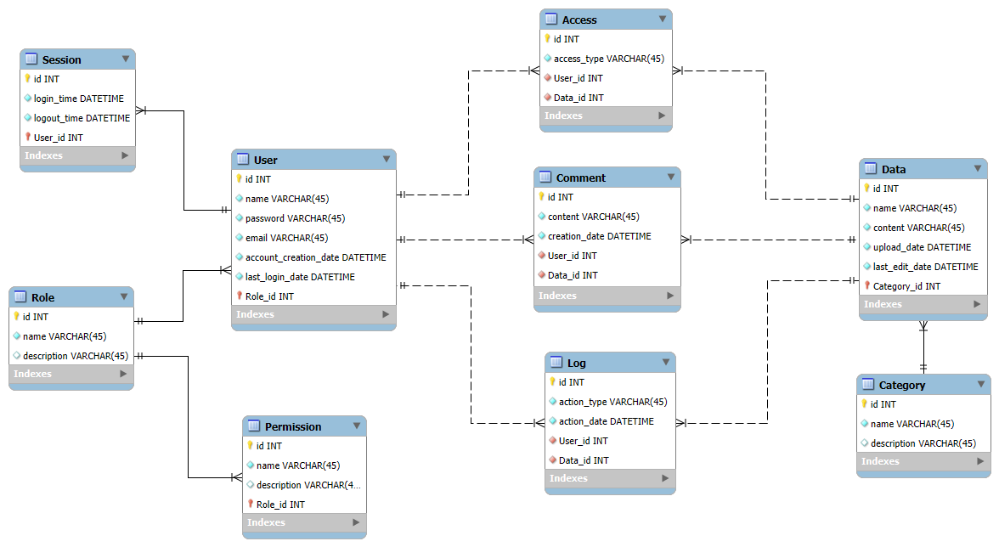

# Проєктування бази даних

## Короткий зміст

- [Проєктування бази даних](#проєктування-бази-даних)
  - [Модель бізнес-об'єктів](#модель-бізнес-обєктів)
  - [ER-модель](#er-модель)
  - [Реляційна схема](#реляційна-схема)
  - [Посилання](#посилання)

## Модель бізнес-об'єктів

**[Модель бізнес-об'єктів](https://www.maxzosim.com/data-modelling/)** описує сутності, класи або об'єкти даних, що мають відношення до предметної області, атрибути, які використовуються для їх опису, та зв'язки між ними, щоб забезпечити загальний набір семантики для аналізу та реалізації.

@startuml

entity User <<ENTITY>> #b2f31d
entity User.id <<NUMBER>> #96cdff
entity User.name <<TEXT>> #96cdff
entity User.password <<TEXT>> #96cdff
entity User.email <<TEXT>> #96cdff
entity User.account_creation_date <<DATETIME>> #96cdff
entity User.last_login_date <<DATETIME>> #96cdff

entity Role <<ENTITY>> #b2f31d
entity Role.id <<NUMBER>> #96cdff
entity Role.name <<TEXT>> #96cdff
entity Role.description <<TEXT>> #96cdff

entity Data <<ENTITY>> #b2f31d
entity Data.id <<NUMBER>> #96cdff
entity Data.name <<TEXT>> #96cdff
entity Data.content <<TEXT>> #96cdff
entity Data.upload_date <<DATETIME>> #96cdff
entity Data.last_edit_date <<DATETIME>> #96cdff

entity Comment <<ENTITY>> #b2f31d
entity Comment.id <<NUMBER>> #96cdff
entity Comment.content <<TEXT>> #96cdff
entity Comment.creation_date <<DATETIME>> #96cdff

entity Permission <<ENTITY>> #b2f31d
entity Permission.id <<NUMBER>> #96cdff
entity Permission.name <<TEXT>> #96cdff
entity Permission.description <<TEXT>> #96cdff

entity Session <<ENTITY>> #b2f31d
entity Session.id <<NUMBER>> #96cdff
entity Session.login_time <<DATETIME>> #96cdff
entity Session.logout_time <<DATETIME>> #96cdff

entity Log <<ENTITY>> #b2f31d
entity Log.id <<NUMBER>> #96cdff
entity Log.action_type <<TEXT>> #96cdff
entity Log.action_date <<DATETIME>> #96cdff

entity Category <<ENTITY>> #b2f31d
entity Category.id <<NUMBER>> #96cdff
entity Category.name <<TEXT>> #96cdff
entity Category.description <<TEXT>> #96cdff

entity Access <<ENTITY>> #b2f31d
entity Access.id <<NUMBER>> #96cdff
entity Access.access_type <<TEXT>> #96cdff

User.id --* User
User.name --* User
User.password --* User
User.email --* User
User.account_creation_date --* User
User.last_login_date --* User

Role.id --* Role
Role.name --* Role
Role.description --* Role

Data.id --* Data
Data.name --* Data
Data.content --* Data
Data.upload_date --* Data
Data.last_edit_date --* Data

Comment.id --* Comment
Comment.content --* Comment
Comment.creation_date --* Comment

Permission.id -u-* Permission
Permission.name -u-* Permission
Permission.description -u-* Permission

Session.id --* Session
Session.login_time --* Session
Session.logout_time --* Session

Log.id -u-* Log
Log.action_type -u-* Log
Log.action_date -u-* Log

Category.id -u-* Category
Category.name -u-* Category
Category.description -u-* Category

Access.id -u-* Access
Access.access_type -u-* Access

User "1,1" -u- "0,*" Session
User "1,1" -u- "0,*" Comment
User "1,1" -- "0,*" Log
User "0,*" -d- "1,1" Role
User "1,1" -- "0,*" Access

Data "1,1" -u- "0,*" Comment
Data "0,*" -d- "1,1" Category
Data "1,1" -- "0,*" Access
Data "1,1" -- "0,*" Log

Role "1,1" -- "0,*" Permission

@enduml

## ER-модель

**[ER-модель](https://www.bestprog.net/uk/2019/01/24/the-concept-of-er-model-the-concept-of-essence-and-communication-attributes-attribute-types-ua/)** – це представлення бази даних у вигляді наочних графічних діаграм. ER-модель візуалізує процес, що визначає деяку предметну область.

@startuml

entity User  {
  id: NUMBER
  name: TEXT
  password: TEXT
  email: TEXT
  account_creation_date: DATETIME
  last_login_date: DATETIME
}

entity Session  {
  id: NUMBER
  login_time: DATETIME
  logout_time: DATETIME
}

entity Role {
    id: NUMBER
    name: TEXT
    description: TEXT
}

entity Permission {
    id: NUMBER
    name: TEXT
    description: TEXT
}

entity Comment {
    id: NUMBER
    content: TEXT
    creation_date: DATETIME
}

entity Data {
    id: NUMBER
    name: TEXT
    content: TEXT
    upload_date: DATETIME
    last_edit_date: DATETIME
}

entity Category {
    id: NUMBER
    name: TEXT
    description: TEXT
}

entity Access {
    id: NUMBER
    access_type: TEXT
}

entity Log {
    id: NUMBER
    action_type: TEXT
    action_date: DATETIM
}
  

User "1,1" -- "0,*" Session
User "0,*" -- "1,1" Role
User "1,1" -- "0,*" Comment
User "1,1" -- "0,*" Log
User "1,1" -- "0,*" Access

Role "1,1" -- "0,*" Permission

Data "1,1" -u- "0,*" Comment
Data "0,*" -u- "1,1" Category
Data "1,1" -u- "0,*" Access
Data "1,1" -u- "0,*" Log

@enduml

## Реляційна схема

**[Реляційна схема](https://zpls.in.ua/shho-take-relyaciyna-skhema-bazi-danikh-kompanii/)** визначається як набір взаємопов’язаних реляційних таблиць і пов’язаних елементів, що охоплює базові таблиці, представлення даних, індекси, домени, ролі користувачів і збережені модулі, створені для задоволення вимог до даних конкретного підприємства або програм.

## Посилання

1. *[Модель бізнес-об'єктів](https://www.maxzosim.com/data-modelling/)*
2. *[ER-модель](https://www.bestprog.net/uk/2019/01/24/the-concept-of-er-model-the-concept-of-essence-and-communication-attributes-attribute-types-ua/)*
3. *[Реляційна схема](https://zpls.in.ua/shho-take-relyaciyna-skhema-bazi-danikh-kompanii/)*
4. *[UML Editor](https://di.molfar.science/design/uml-editor#/)*
