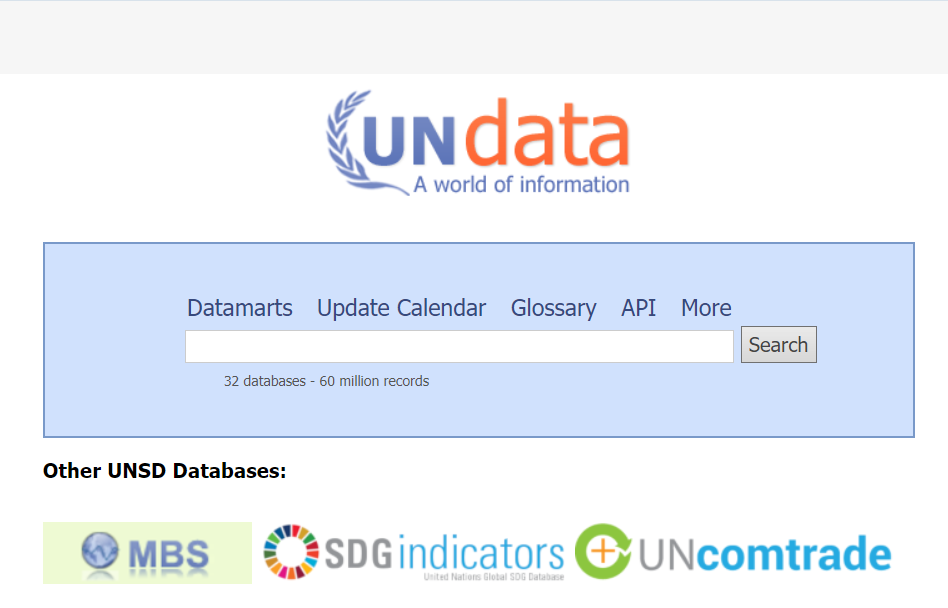

# Аналіз предметної області

## Вступ

*[Вступ повинен містити короткий огляд всього документу.]*

## Основні визначення

*[Розділ містить визначення термінів та скорочень, які використовуються при аналізі предметної області.]*

## Підходи та способи вирішення завдання

### Способи аналізу даних

#### [Машинне навчання (Machine learning)](https://uk.wikipedia.org/wiki/%D0%9C%D0%B0%D1%88%D0%B8%D0%BD%D0%BD%D0%B5_%D0%BD%D0%B0%D0%B2%D1%87%D0%B0%D0%BD%D0%BD%D1%8F)

Машинне навчавння — це галузь досліджень штучного інтелекту, зосереджена на розробці та вивченні статистичних алгоритмів, здатних навчатися з даних і узагальнюватися на небачені дані, й відтак виконувати завдання без явних інструкцій. Породжувальні штучні нейронні мережі нещодавно змогли перевершити за продуктивністю багато попередніх підходів.

>Підходи машинного навчання застосовували до багатьох галузей, серед яких великі мовні моделі, комп'ютерне бачення, розпізнавання мовлення, фільтрування електронної пошти, сільське господарство та медицина, де розробка алгоритмів для виконання необхідних завдань була би занадто витратною. Машинне навчання відоме у своєму застосуванні в комерційних задачах під назвою «передбачувальна аналітика».

Хоч і не все машинне навчання ґрунтується на статистиці, обчислювальна статистика є важливим джерелом методів цієї галузі.

На початку розвитку ШІ деякі дослідники були зацікавлені в тому, щоб машини навчалися з даних. Вони використовували різні символьні методи, а також нейронні мережі — здебільшого перцептрони та інші моделі, які виявилися перевинаходами узагальнених лінійних моделей статистики. Також застосовували ймовірнісне міркування, особливо в автоматизованому медичному діагностуванні. Посилення акценту на логічному підході, що ґрунтується на знаннях, спричинило розрив між ШІ та машинним навчанням. Імовірнісні системи страждали на теоретичні та практичні проблеми збирання та подання даних. Близько 1980 року експертні системи почали домінувати в ШІ, а статистика відійшла на другий план. Незважаючи на це, навчання на основі символів та знань продовжувалося в межах ШІ, ведучи до індуктивного логічного програмування, але статистичні дослідження перемістилися в галузі розпізнавання образів та інформаційного пошуку.

#### [Табличні процесори (Spreadsheet)](https://translations.com.ua/tablychnyi-procesor.html)

Табличний процесор, або електронна таблиця — це тип програмного забезпечення, яке використовується для організації, зберігання та роботи з даними в табличному форматі. Табличний процесор схожий на цифрову версію паперового аркуша. Це інструмент, який дозволяє впорядковувати дані в рядках і стовпцях та працювати з ними, подібно до великої таблиці. Зазвичай, електронна таблиця — це сітка рядків і стовпців, кожна клітинка якої містить певний фрагмент даних. Це дозволяє легко вводити, організовувати та редагувати дані.

Електронні таблиці також підтримують складні математичні та статистичні операції. Це дозволяє користувачам працювати з великими наборами даних, отримуючи миттєві результати.

>За допомогою електронної таблиці можна виконувати обчислення та інші дії з даними, а результати автоматично оновлюються в режимі реального часу. Саме тому табличний процесор є дуже корисним інструментом для різних видів роботи, таких як фінансове моделювання, аналіз даних та управління проєктами.

>Табличний процесор пропонує розширені функції, такі як макроси та мови сценаріїв. Це дозволяє автоматизувати повторювані завдання та створювати власні функціональні можливості, що може заощадити багато часу та зусиль.

#### [Мови програмування](https://uk.wikipedia.org/wiki/%D0%9C%D0%BE%D0%B2%D0%B0_%D0%BF%D1%80%D0%BE%D0%B3%D1%80%D0%B0%D0%BC%D1%83%D0%B2%D0%B0%D0%BD%D0%BD%D1%8F#%D0%9A%D0%BB%D0%B0%D1%81%D0%B8%D1%84%D1%96%D0%BA%D0%B0%D1%86%D1%96%D1%8F_%D0%BC%D0%BE%D0%B2_%D0%BF%D1%80%D0%BE%D0%B3%D1%80%D0%B0%D0%BC%D1%83%D0%B2%D0%B0%D0%BD%D0%BD%D1%8F)

Мова програмування — це штучна мова, створена для передачі команд машинам, зокрема комп'ютерам. Вона є певною штучною формальною системою, засобами якої можна виражати алгоритми. Мова програмування визначається набором лексичних, синтаксичних і семантичних правил, які задають зовнішній вигляд програми та дії, що виконує комп'ютер під її управлінням.

>Мови програмування високого рівня оперують сутностями ближчими людині, такими як об'єкти, змінні, функції. Мови програмування нижчого рівня оперують сутностями ближчими машині: байти, адреси, інструкції. Текст програми мовою високого рівня зазвичай набагато коротший ніж текст такої самої програми мовою низького рівня, проте програма має більший розмір.

Мови програмування можуть бути реалізовані як компільовані та інтерпретовані. Програма компільованою мовою за допомогою компілятора, особливої ​​програми, компілюється в машинний код (набір інструкцій) для даного типу процесора, що записується у об'єктний модуль. З одного або кількох об'єктних файлів компонувальник формує виконуваний файл, який може бути запущений на виконання як окрема програма. Іншими словами, компілятор переводить вихідний текст програми з мови програмування високого рівня в двійкові коди інструкцій процесора. Якщо програма написана скриптовою мовою, то інтерпретатор безпосередньо виконує (інтерпретує) вихідний текст без попереднього перекладу. При цьому програма залишається мовою оригіналу і не може бути запущена без інтерпретатора. Процесор комп'ютера, у зв'язку з цим, можна назвати інтерпретатором для машинного коду.

### [API (Application Programming Interface)](https://uk.wikipedia.org/wiki/%D0%9F%D1%80%D0%B8%D0%BA%D0%BB%D0%B0%D0%B4%D0%BD%D0%B8%D0%B9_%D0%BF%D1%80%D0%BE%D0%B3%D1%80%D0%B0%D0%BC%D0%BD%D0%B8%D0%B9_%D1%96%D0%BD%D1%82%D0%B5%D1%80%D1%84%D0%B5%D0%B9%D1%81)
API — це набір визначених методів та протоколів, за допомогою яких одне програмне забезпечення може взаємодіяти з іншим. API дозволяють програмам отримувати доступ до певних функцій або даних сервісу без необхідності знати деталі його внутрішньої роботи.

**Де застосовується:**

API використовуються в багатьох сферах:

+ **Соціальні мережі:** отримання даних користувачів, постів та ін.
+ **Фінансові послуги:** взаємодія між банківськими системами та фінтех-додатками.
+ **Геолокаційні сервіси:** інтеграція картографічних та логістичних рішень через API (Google Maps, OpenStreetMap).
+ **Електронна комерція:** доступ до товарних каталогів, управління замовленнями тощо.

**Переваги:**
+ **Простота інтеграції:** API часто мають детальну документацію, що спрощує їх використання.
+ **Структуровані дані:** API надає добре організовані дані у форматах JSON, XML тощо.
+ **Мінімальна обробка:** Оскільки дані зазвичай структуровані, їх легше обробляти та аналізувати.

**Недоліки:**
+ **Обмеження:** API часто мають ліміти на кількість запитів за певний час (щоденний ліміт запитів).
+ **Залежність:** Зміна або припинення підтримки API може стати проблемою.
+ **Безпека:** Потрібно дотримуватися політики безпеки при доступі до конфіденційних даних через API.

**Приклад:**
[Facebook Graph API](https://developers.facebook.com/docs/graph-api/overview/) дозволяє отримувати дані з профілів користувачів та аналізувати їх взаємодію, але при цьому вимагає авторизації та дотримання певних умов використання.

---------------------------------------

### [Веб-скрапінг (Web Scraping)](https://uk.wikipedia.org/wiki/Web_scraping)
Веб-скрапінг — це техніка автоматизованого витягання інформації з вебсторінок. Скрипт "читає" HTML-код сайту і витягує необхідні дані (тексти, зображення, таблиці).

**Де застосовується:**
+ **Аналіз ринку:** збирання інформації про ціни товарів і послуг з сайтів електронної комерції.
+ **Новинні агрегатори:** автоматичний збір статей з різних новинних порталів.
+ **Інтеграція даних:** збирання інформації з публічних баз даних або платформ (наприклад, спортивні результати, котирування акцій).

**Переваги:**
+ **Доступ до публічних даних:** Скрейпінг дозволяє отримувати дані, що не завжди доступні через API.
+ **Гнучкість:** Можна збирати дані з будь-яких вебсайтів, незалежно від їхньої структури.
+ **Швидкість:** Автоматизація дозволяє отримати велику кількість даних за короткий час.

**Недоліки:**
+ **Юридичні обмеження:** Деякі сайти забороняють скрейпінг своїх сторінок через "robots.txt" або внутрішні політики.
+ **Зміна структури:** Якщо сайт змінює структуру, скрипт може перестати працювати і потребує оновлення.
+ **Проблеми з правами** на дані: Витягнуті дані можуть бути захищені авторськими правами.

**Приклад:**
Збирання даних про ціни товарів з сайтів Amazon або eBay для порівняння цін.

---------------------------------------

### [Веб-краулінг (Web Crawling)](https://uk.wikipedia.org/wiki/%D0%9F%D0%BE%D1%88%D1%83%D0%BA%D0%BE%D0%B2%D0%B8%D0%B9_%D1%80%D0%BE%D0%B1%D0%BE%D1%82)
Веб-краулер — це програма, що автоматично переглядає вебсторінки, переходячи за гіперпосиланнями. Основна мета — індексування сайтів для пошукових систем або масове збирання даних з великої кількості сторінок.

**Де застосовується:**
+ **Пошукові системи:** Google, Bing, Yahoo використовують краулери для індексації сторінок інтернету.
+ **SEO-оптимізація:** аналіз контенту конкурентів для визначення стратегій пошукової оптимізації.
+ **Дослідження ринку:** автоматизований збір даних для аналізу трендів.

**Переваги:**
+ **Обробка великої кількості сторінок:** Можливість охоплювати тисячі або мільйони сторінок автоматично.
+ **Створення індексів:** Веб-краулінг є основою для пошукових систем, що дозволяє швидкий пошук інформації в інтернеті.

**Недоліки:**
+ **Високі вимоги до ресурсів:** Веб-краулінг потребує великої кількості обчислювальних ресурсів і часу.
+ **Юридичні обмеження:** Багато сайтів встановлюють правила проти неконтрольованого краулінгу.
+ **Обробка дублікатів:** Краулери можуть отримувати дублікатні сторінки, що потребує додаткової обробки.

**Приклад:**
[Googlebot](https://uk.wikipedia.org/wiki/Googlebot) — це краулер, що індексує мільйони сторінок щодня, збираючи дані для пошукових результатів.

---------------------------------------

### [Краудсорсинг (Crowdsourcing)](https://uk.wikipedia.org/wiki/%D0%9A%D1%80%D0%B0%D1%83%D0%B4%D1%81%D0%BE%D1%80%D1%81%D0%B8%D0%BD%D0%B3)
Краудсорсинг — це метод збору інформації або вирішення завдань за допомогою великої кількості людей (часто через інтернет). Інформацію або рішення надають користувачі, що сприяє колективній роботі.

**Де застовується:**
+ **Створення контенту:** Wikipedia — найбільша краудсорсингова платформа для збору та редагування енциклопедичної інформації.
+ **Соціальні дослідження:** збору думок, проведення анкетувань або голосувань.
+ **Бізнес-рішення:** збір ідей від клієнтів для покращення продуктів або послуг (наприклад, через платформи типу Kickstarter).

**Переваги:**
+ **Широкий доступ до ресурсів:** Залучення багатьох людей дозволяє швидко збирати великі обсяги даних або ідей.
+ **Доступ до різноманітної інформації:** Різні користувачі можуть надавати різні точки зору та унікальні рішення.

**Недоліки:**
+ **Контроль якості:** Краудсорсинг може призводити до отримання неточної або неперевіреної інформації.
+ **Мотивація учасників:** Користувачі можуть втрачати інтерес, якщо завдання не мотивують або процес стає занадто складним.

**Приклади:**
[Waze](https://uk.wikipedia.org/wiki/Waze) — додаток для навігації, що збирає інформацію про дорожні умови через краудсорсинг від користувачів.

## Порівняльна характеристика існуючих засобів вирішення завдання

### [Google Public Data Explorer](https://www.google.com/publicdata/directory)

**Google Public Data Explorer** — це інструмент, створений Google, який дозволяє користувачам знаходити, досліджувати та візуалізувати великі набори відкритих даних. Цей сервіс надає можливість створювати інтерактивні графіки, карти та діаграми на основі даних, що надходять від урядових установ, міжнародних організацій та дослідницьких інституцій.

### [Gapminder](https://www.gapminder.org)

**Gapminder** — це некомерційна організація, заснована шведським професором Гансом Рослінгом, з метою популяризації глобальної освіти через статистичні дані. Gapminder розробляє інструменти, які допомагають візуалізувати світові тренди в різних сферах, таких як здоров'я, економіка, демографія та соціальний розвиток. Gapminder відіграє важливу роль у популяризації наукових даних і використовується у навчальних закладах, наукових дослідженнях і медіа для аналізу глобальних трендів.

### [The World Bank DataBank](https://databank.worldbank.org)

**The World Bank DataBank** — це інтерактивний інструмент, створений Світовим банком для надання доступу до величезної кількості світових економічних та соціальних даних. Він дозволяє користувачам переглядати, аналізувати та завантажувати дані, що стосуються таких сфер, як розвиток, економіка, демографія, інфраструктура, освіта, охорона здоров'я, екологія тощо.

### [OpenStreetMap](https://www.openstreetmap.org)

**OpenStreetMap (OSM)** — це краудсорсингова платформа, що забезпечує вільний доступ до географічних даних усього світу. Проект був заснований у 2004 році Стівом Коастом, і з того часу став однією з найбільших відкритих географічних баз даних. OSM використовує колективний внесок добровольців, які збирають, редагують і додають географічні дані, такі як дороги, будівлі, річки, ландшафти, кордони тощо. Відкритість платформи дозволяє її широке використання в різних галузях — від мобільних додатків до досліджень і гуманітарної допомоги.

### [UNdata](https://data.un.org)

**UNdata** — це платформа, створена Статистичним відділом Організації Об'єднаних Націй (ООН) для надання доступу до різноманітних статистичних даних, що охоплюють численні галузі, зібрані з країн-членів ООН та міжнародних агентств. UNdata дозволяє дослідникам, аналітикам, журналістам і будь-кому зацікавленому отримувати доступ до важливої інформації для аналізу, планування та моніторингу глобальних і національних показників.

### Табличне порівняння

Критерії:
- 🟢 - функція реалізована
- 🟡 - функція реалізована частково або має певні недоліки
- ❌ - функція не реалізована

| Загальні вимоги | Конкретні вимоги | G.P.D.E. | Gapminder | DataBank | OpenStreetMap | UNdata |
|-------------|-------------|-------------|-------------|-------------|-------------|-------------|
| Functionality | Відповідність вимогам | 🟢 | 🟢 | 🟢 | 🟢 | 🟢 |
| | Інтеграція з іншими системами | 🟡 | 🟡 | 🟡 | 🟢 | 🟡 |
| | Безпека | 🟢 | 🟢 | 🟢 | 🟡 | 🟢 |
| | Візуалізація даних | 🟢 | 🟢 | 🟢 | 🟢 | 🟡 |
| Usability | Легкість навчання | 🟢 | 🟢 | 🟢 | 🟡 | 🟢 |
| | Підтримка багатьох мов | 🟡 | 🟡 | 🟢 | 🟢 | 🟢 |
| | Документація | 🟢 | 🟢 | 🟢 | 🟢 | 🟢 |
| | Інтуїтивний інтерфейс | 🟢 | 🟢 | 🟡 | 🟡 | 🟡 |
| Reliability | Точність результатів | 🟢 | 🟢 | 🟢 | 🟡 | 🟢 |
| | Стійкість до навантажень | 🟡 | 🟢 | 🟢 | 🟢 | 🟢 |
| | Відновлюваність | 🟢 | 🟢 | 🟢 | 🟢 | 🟢 |
| | Ліцензія | 🟢 | 🟢 | 🟢 | 🟢 | 🟢 |
| Performance | Швидкість виконання | 🟡 | 🟢 | 🟡 | 🟢 | 🟡 |
| | Масштабованість | 🟡 | 🟡 | 🟢 | 🟢 | 🟢 |
| Supportability | Зворотний зв'язок | 🟡 | 🟡 | 🟡 | 🟢 | 🟡 |
| | Оновлюваність | 🟢 | 🟢 | 🟢 | 🟢 | 🟢 |

## Висновки

*[Робляться висновки щодо доцільності розробки нової або модифікації існуючої інформаційної системи, необхідності та способів інтеграції з системами(сервісами) третіх сторін, тощо.]*

## Посилання

*[Розділ містить повний список всіх документів, про які згадується.]*
