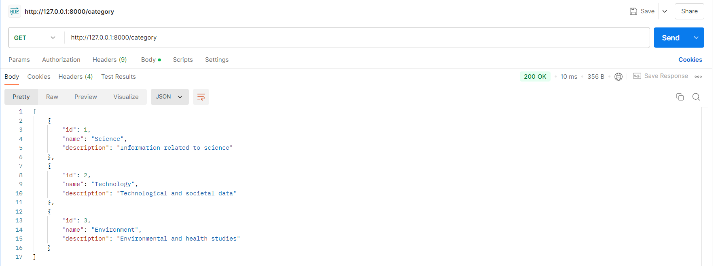
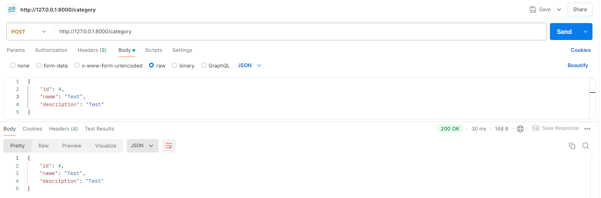
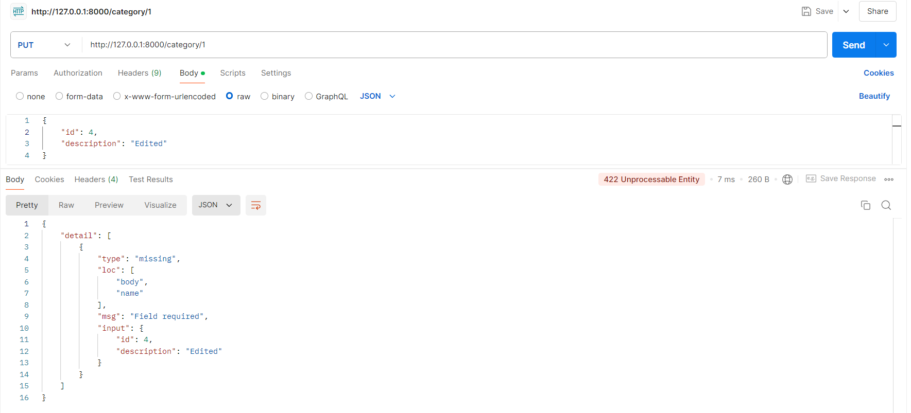
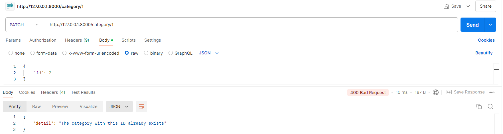

# Тестування працездатності системи

## Короткий зміст

- [Тестування працездатності системи](#тестування-працездатності-системи)
  - [Основний сценарій для Data](#основний-сценарій-для-data)
    - [GET](#get)
    - [POST](#post)
    - [PUT](#put)
    - [DELETE](#delete)
    - [PATCH](#patch)
  - [Основний сценарій для Category](#основний-сценарій-для-category)
    - [GET](#get)
    - [POST](#post)
    - [PUT](#put)
    - [DELETE](#delete)
    - [PATCH](#patch)
  - [Виключні ситуації для Data](#виключні-ситуації-для-data)
    - [GET](#get)
    - [POST](#post)
    - [PUT](#put)
    - [DELETE](#delete)
    - [PATCH](#patch)
  - [Виключні ситуації для Category](#виключні-ситуації-для-category)
    - [GET](#get)
    - [POST](#post)
    - [PUT](#put)
    - [DELETE](#delete)
    - [PATCH](#patch)

## Основний сценарій для Data
### GET
Get-запит на отримання всіх даних

Get-запит на отримання даних за id

### POST
Post-запит на додавання даних з усіма заповненими полями

Post-запит на додавання даних без id, upload_date, last_edit_date

*Примітка. Для id встановлено autoincrement, для upload_date за замовчуванням встановлюються поточні дата і час, для last_edit_date за замовчуванням встановлюється null.*

### PUT
Put-запит на оновлення id, name, content та category

*Дані до оновлення*

*Оновлення даних*

### DELETE
Delete-запит на видалення даних

*Перевірка існування даних*

*Видалення даних*

*Перевірка видалення даних*

### PATCH
Patch-запит на оновлення name

*Дані до оновлення*

*Оновлення name*

## Основний сценарій для Category
### GET
Get-запит на отримання всіх категорій

Get-запит на отримання категорії за id

### POST
Post-запит на додавання категорії з усіма заповненими полями

Post-запит на додавання категорії без id та description

*Примітка. Для id встановлено autoincrement, для description за замовчуванням встановлюється null.*

### PUT
Put-запит на оновлення id, name, description

*Дані категорії до оновлення*

*Оновлення даних категорії*

### DELETE
Delete-запит на видалення категорії

*Перевірка існування категорії*

*Видалення категорії*

*Перевірка видалення категорії*

### PATCH
Patch-запит на оновлення id

*Дані категорії до оновлення*

*Оновлення id*

Patch-запит на оновлення id категорії, якій належать дані

*Примітка. Для foreign key “Category_id” встановлено ON UPDATE CASCADE, що автоматично оновлює значення Category_id, якщо було змінено id у Category.*

*Дані до оновлення id категорії*

*Оновлення id категорії*

*Дані після оновлення id категорії*

## Виключні ситуації для Data
### GET
Немає даних із заданим id

### POST
Введено не всі дані, що є обов’язковими для заповнення

Введено id, дані з яким уже існують у системі

*Примітка. id має бути неповторюваним значенням.*

Введено name, дані з яким уже існують у системі

*Примітка. name має бути неповторюваним значенням.*

Введено неіснуючий category_id

### PUT
Введено не всі дані, що є обов’язковими для заповнення

Немає даних із заданим id

Введено id, дані з яким уже існують у системі

*Примітка. id має бути неповторюваним значенням.*

Введено name, дані з яким уже існують у системі

*Примітка. name має бути неповторюваним значенням.*

Введено неіснуючий category_id

### DELETE
Немає даних із заданим id 

### PATCH
Немає даних із заданим id

Введено id, дані з яким уже існують у системі

*Примітка. id має бути неповторюваним значенням.*

Введено name, дані з яким уже існують у системі

*Примітка. name має бути неповторюваним значенням.*

Введено неіснуючий category_id

## Виключні ситуації для Category
### GET
Немає категорії із заданим id

### POST
Введено не всі дані, що є обов’язковими для заповнення

Введено id, категорія з яким уже існує в системі

*Примітка. id має бути неповторюваним значенням.*

### PUT
Введено не всі дані, що є обов’язковими для заповнення

Немає категорії із заданим id

Введено id, категорія з яким уже існує в системі

*Примітка. id має бути неповторюваним значенням.*

### DELETE
Немає категорії із заданим id 

Неможливо видалити категорію, якій належать дані

*Примітка. Для foreign key “Category_id” встановлено ON DELETE NO ACTION, що забороняє видаляти категорії, яким належать певні дані*

### PATCH
Немає категорії із заданим id

Введено id, категорія з яким уже існує в системі

*Примітка. id має бути неповторюваним значенням.*

