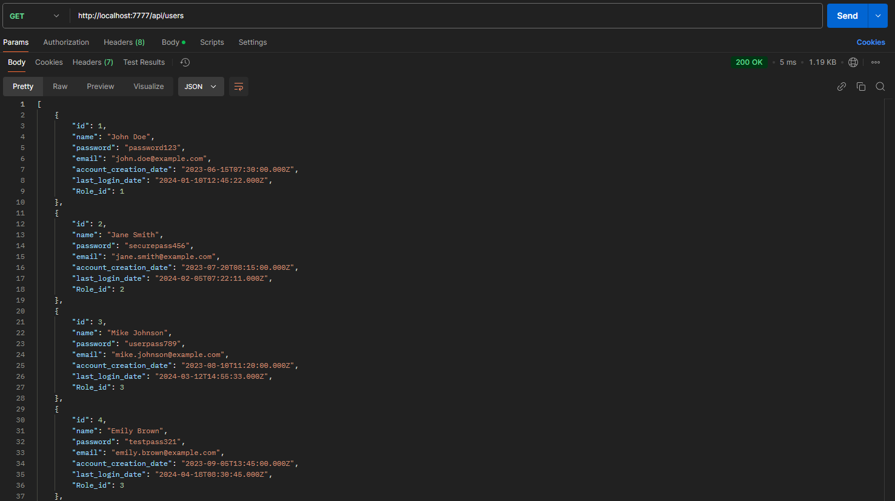
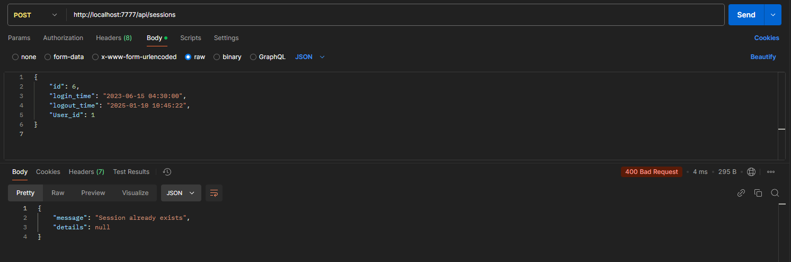

# Тестування працездатності системи

## Короткий зміст

- [Тестування працездатності системи](#тестування-працездатності-системи)
  - [Основний сценарій для User](#основний-сценарій-для-user)
    - [GET](#get)
    - [POST](#post)
    - [PUT](#put)
    - [DELETE](#delete)
    - [PATCH](#patch)
  - [Основний сценарій для Session](#основний-сценарій-для-session)
    - [GET](#get)
    - [POST](#post)
    - [PUT](#put)
    - [DELETE](#delete)
    - [PATCH](#patch)
  - [Виключні ситуації для User](#виключні-ситуації-для-user)
    - [GET](#get)
    - [POST](#post)
    - [PUT](#put)
    - [DELETE](#delete)
    - [PATCH](#patch)
  - [Виключні ситуації для Session](#виключні-ситуації-для-session)
    - [GET](#get)
    - [POST](#post)
    - [PUT](#put)
    - [DELETE](#delete)
    - [PATCH](#patch)

## Основний сценарій для User
### GET
Get-запит на отримання всіх даних

### POST
Post-запит на додавання даних з усіма заповненими полями

### PUT
Put-запит на оновлення id, name, content та category

### DELETE
Delete-запит на видалення даних

### PATCH
Patch-запит на оновлення name

## Основний сценарій для Session
### GET
Get-запит на отримання всіх категорій

### POST
Post-запит на додавання категорії з усіма заповненими полями

### PUT
Put-запит на оновлення id, name, description

### DELETE
Delete-запит на видалення категорії

### PATCH
Patch-запит на оновлення id

## Виключні ситуації для User
### GET
Немає даних із заданим id

### POST
Введено не всі дані, що є обов’язковими для заповнення

### PUT
Введено не всі дані, що є обов’язковими для заповнення

### DELETE
Немає даних із заданим id 

### PATCH
Немає даних із заданим id

## Виключні ситуації для Session

### GET
Немає категорії із заданим id

### POST
Введено не всі дані, що є обов’язковими для заповнення

### PUT
Введено не всі дані, що є обов’язковими для заповнення

### DELETE
Немає категорії із заданим id 

### PATCH
Немає категорії із заданим id

