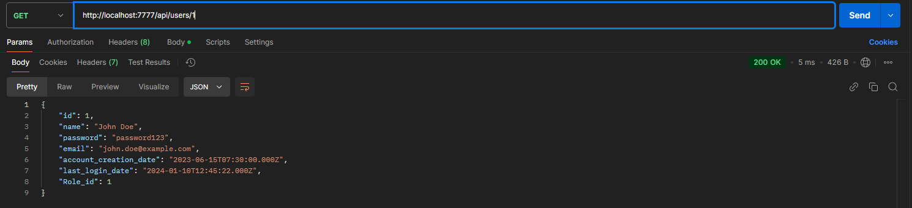
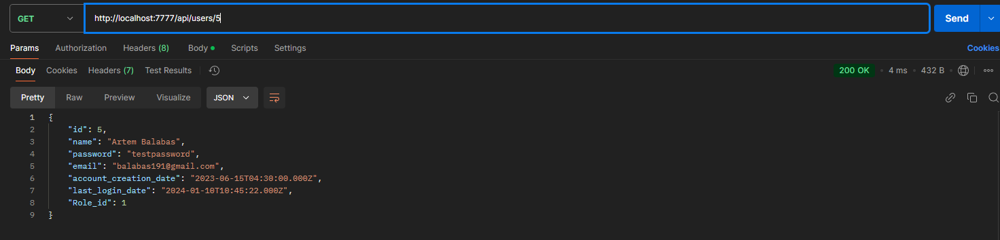
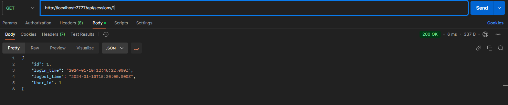
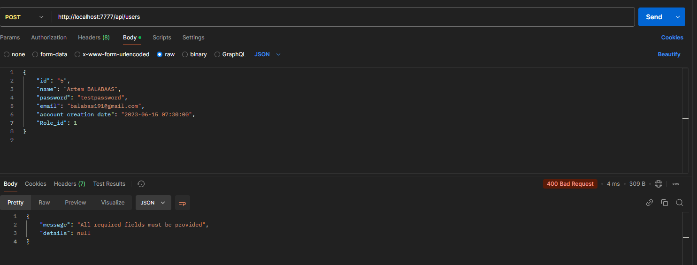
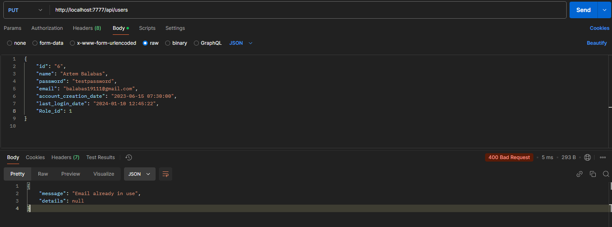
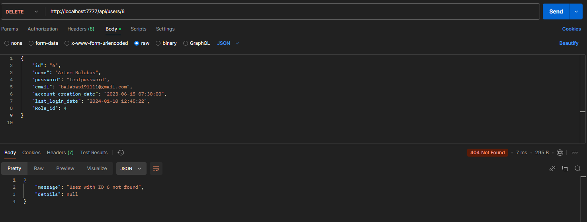
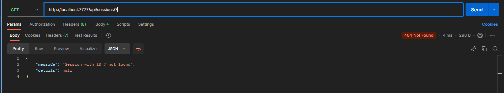
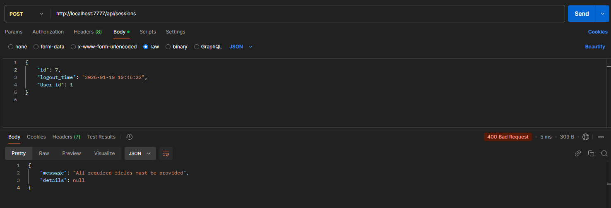

# Тестування працездатності системи

## Короткий зміст

- [Тестування працездатності системи](#тестування-працездатності-системи)
  - [Основний сценарій для User](#основний-сценарій-для-user)
    - [GET](#get)
    - [POST](#post)
    - [PUT](#put)
    - [DELETE](#delete)
  - [Основний сценарій для Session](#основний-сценарій-для-session)
    - [GET](#get)
    - [POST](#post)
    - [PUT](#put)
    - [DELETE](#delete)
  - [Виключні ситуації для User](#виключні-ситуації-для-user)
    - [GET](#get)
    - [POST](#post)
    - [PUT](#put)
    - [DELETE](#delete)
  - [Виключні ситуації для Session](#виключні-ситуації-для-session)
    - [GET](#get)
    - [POST](#post)
    - [PUT](#put)
    - [DELETE](#delete)

## Основний сценарій для User
### GET
Get-запит на отримання всіх даних

Get-запит на отримання даних по ID

### POST
Post-запит на додавання даних з усіма заповненими полями

Get-запит на отримання даних створеного User

### PUT
Put-запит на оновлення name

Get-запит на отримання даних оновленого User

### DELETE
Delete-запит на видалення даних

Get-запит на отримання всіх даних (User з ID 5 зник)

## Основний сценарій для Session
### GET
Get-запит на отримання всіх даних

Get-запит на отримання даних по ID

### POST
Post-запит на додавання даних з усіма заповненими полями

Get-запит на отримання даних створеного Session

### PUT
Put-запит на оновлення logout_time

Get-запит на отримання даних оновленого Session

### DELETE
Delete-запит на видалення даних

Get-запит на отримання всіх даних (Session з ID 6 зник)

## Виключні ситуації для User
### GET
Немає User за заданим ID

Недійсний або відсутній ID користувача

### POST
User за заданим ID вже існує

Необхідно заповнити всі обов'язкові поля

Вже використовується email

Role не існує, неможливо створити User

### PUT
Немає User за заданим ID

Необхідно заповнити всі обов'язкові поля

Вже використовується email

Role не існує, неможливо оновити User

### DELETE
Немає User за заданим ID

## Виключні ситуації для Session

### GET
Немає Session за заданим ID

Недійсний або відсутній ID користувача

### POST
Session за заданим ID вже існує

Необхідно заповнити всі обов'язкові поля

User не існує, неможливо створити Session

### PUT
Немає Session за заданим ID

Необхідно заповнити всі обов'язкові поля

User не існує, неможливо оновити Session

### DELETE
Немає Session за заданим ID

