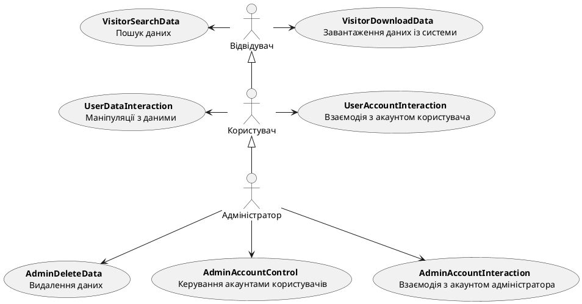
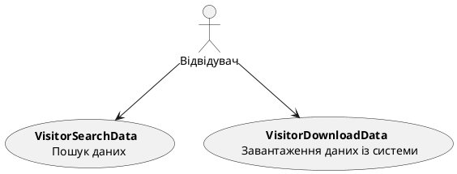
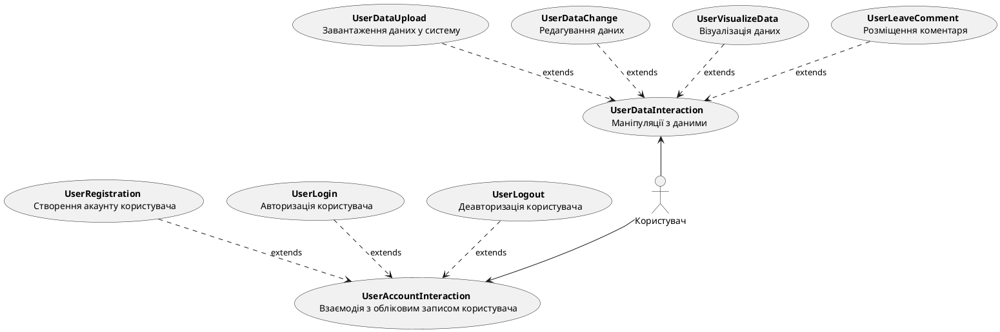
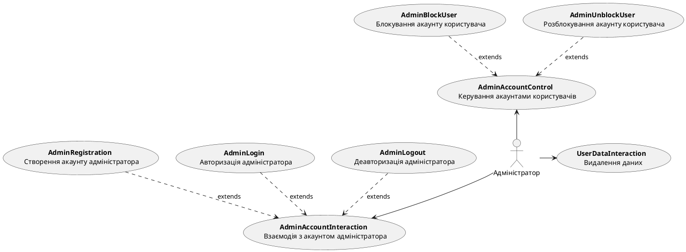
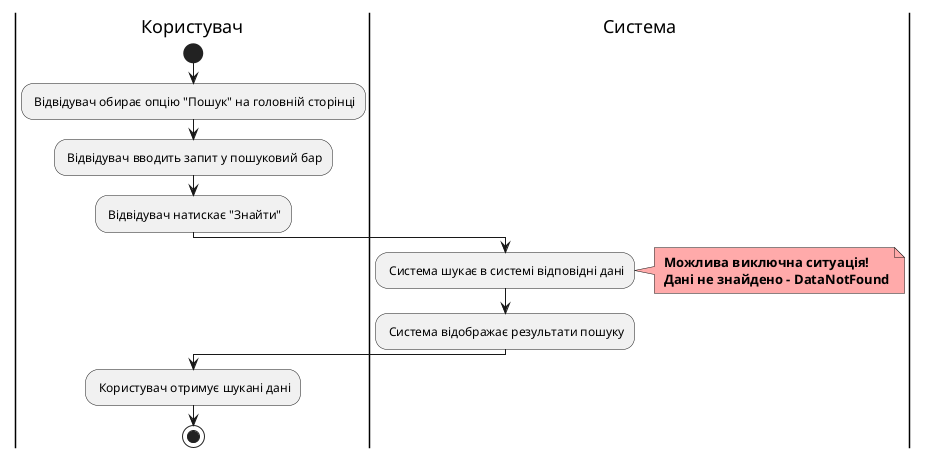

# Модель прецедентів

## Короткий зміст

- [Модель прецедентів](#модель-прецедентів)
  - [Короткий зміст](#короткий-зміст)
  - [Діаграми прецедентів бізнес-акторів](#діаграми-прецедентів-бізнес-акторів)
    - [Загальна діаграма прецедентів](#загальна-діаграма-прецедентів)
    - [Діаграма прецедентів для відвідувача](#діаграма-прецедентів-для-відвідувача)
    - [Діаграма прецедентів для користувача](#діаграма-прецедентів-для-користувача)
    - [Діаграма прецедентів для адміністратора](#діаграма-прецедентів-для-адміністратора)
  - [Діаграми діяльності](#діаграми-діяльності)
    - [Діаграма діяльності для UC_1 "Пошук даних"](#діаграма-діяльності-для-uc_1-пошук-даних")
    - [Діаграма діяльності для UC_2 "Завантаження даних із системи"](#діаграма-діяльності-для-uc_2-завантаження-даних-із-системи)
    - [Діаграма діяльності для UC_3.1 "Завантаження даних у систему"](#діаграма-діяльності-для-uc_31-завантаження-даних-у-систему)
    - [Діаграма діяльності для UC_3.2 "Редагування даних"](#діаграма-діяльності-для-uc_32-редагування-даних)
    - [Діаграма діяльності для UC_3.3 "Візуалізація даних"](#діаграма-діяльності-для-uc_33-візуалізація-даних)
    - [Діаграма діяльності для UC_3.4 "Розміщення коментаря"](#діаграма-діяльності-для-uc_34-розміщення-коментаря)
    - [Діаграма діяльності для UC_4.1 "Створення акаунту користувача"](#діаграма-діяльності-для-uc_41-створення-акаунту-користувача)
    - [Діаграма діяльності для UC_4.2 "Авторизація користувача"](#діаграма-діяльності-для-uc_42-авторизація-користувача)
    - [Діаграма діяльності для UC_4.3 "Деавторизація користувача"](#діаграма-діяльності-для-uc_43-деавторизація-користувача)
    - [Діаграма діяльності для UC_5 "Видалення даних"](#діаграма-діяльності-для-uc_5-видалення-даних)
    - [Діаграма діяльності для UC_6.1 "Блокування акаунту користувача"](#діаграма-діяльності-для-uc_61-Блокування-акаунту-користувача)
    - [Діаграма діяльності для UC_6.2 "Розблокування акаунту користувача"](#діаграма-діяльності-для-uc_62-розблокування-акаунту-користувача)
    - [Діаграма діяльності для UC_7.1 "Створення акаунту адміністратора"](#діаграма-діяльності-для-uc_71-створення-акаунту-адміністратора)
    - [Діаграма діяльності для UC_7.2 "Авторизація адміністратора"](#діаграма-діяльності-для-uc_72-авторизація-адміністратора)
    - [Діаграма діяльності для UC_7.3 "Деавторизація адміністратора"](#діаграма-діяльності-для-uc_73-деавторизація-адміністратора)
  - [Посилання](#посилання)

## Діаграми прецедентів бізнес-акторів

**[Діаграма прецедентів](https://uk.wikipedia.org/wiki/Діаграма_прецедентів)** (англ. Use case diagram) — в UML, діаграма, на якій зображено відношення між акторами та прецедентами в системі. Діаграма прецедентів показує різні варіанти використання та різні типи користувачів системи і часто супроводжується іншими типами діаграм. Варіанти використання представлені колами або еліпсами. Актори (дійові особи) часто зображуються у вигляді паличок.

### Загальна діаграма прецедентів

### Діаграма прецедентів для відвідувача

### Діаграма прецедентів для користувача

### Діаграма прецедентів для адміністратора

## Діаграми діяльності

**[Діаграма діяльності](https://dou.ua/forums/topic/40575/)** — це блок-схема, яка показує, як одна діяльність призводить до іншої. Загалом діаграма діяльності візуалізує процес використання та ілюструє потік повідомлень від однієї дії до іншої, показує цілісну роботу системи. Ці дії можуть виконуватися людьми, програмними компонентами або комп’ютерами. Потік керування (порядок виконання) на діаграмі діяльності переходить від однієї операції до іншої; він може бути послідовним, розгалуженим або одночасним.

### Діаграма діяльності для UC_1 "Пошук даних"

| **ID:**                | VisitorSearchData                                                                                    |
|------------------------|--------------------------------------------------------------------------------------------------|
| **НАЗВА:**             | Знайти дані в системі за запитом відвідувача |
| **УЧАСНИКИ:**          | Відвідувач, Система |
| **ПЕРЕДУМОВИ:**        | Відвідувач не авторизований |
| **РЕЗУЛЬТАТ:**         | Дані знайдено та відображено |
| **ВИКЛЮЧНІ СИТУАЦІЇ:** | Дані не знайдено - DataNotFound |
| **ОСНОВНИЙ СЦЕНАРІЙ:** | 1. Відвідувач обирає опцію "Пошук" на головній сторінці.  2. Відвідувач вводить запит у пошуковий бар.  3. Відвідувач натискає "Знайти".  4. Система шукає в системі відповідні дані.  5. Cистема відображає результати пошуку.  6. Користувач отримує шукані дані. |

### Діаграма діяльності для UC_2 "Завантаження даних із системи"

| **ID:**                | VisitorDownloadData                                                                                      |
|------------------------|--------------------------------------------------------------------------------------------------|
| **НАЗВА:**             | Завантаження відвідувачем даних із системи |
| **УЧАСНИКИ:**          | Відвідувач, Система |
| **ПЕРЕДУМОВИ:**        | Відвідувач не авторизований |
| **РЕЗУЛЬТАТ:**         | Дані завантажено на пристрій відвідувача |
| **ВИКЛЮЧНІ СИТУАЦІЇ:** | Немає даних для завантаження - NoDataToDownload |
| **ОСНОВНИЙ СЦЕНАРІЙ:** | 1. Відвідувач обирає опцію "Завантажити дані".  2. Відвідувач обирає тип даних для завантаження.  3. Система опрацьовує запит відвідувача.  4. Система генерує файл для завантаження.  5. Відвідувач завантажує файл із системи. |

### Діаграма діяльності для UC_3.1 "Завантаження даних у систему"

| **ID:**                | UserDataUpload                                                                                      |
|------------------------|--------------------------------------------------------------------------------------------------|
| **НАЗВА:**             | Завантажити дані в систему |
| **УЧАСНИКИ:**          | Користувач, Система |
| **ПЕРЕДУМОВИ:**        | Користувач авторизований |
| **РЕЗУЛЬТАТ:**         | Дані завантажено в систему |
| **ВИКЛЮЧНІ СИТУАЦІЇ:** | Неправильний формат даних - InvalidDataFormat |
| **ОСНОВНИЙ СЦЕНАРІЙ:** | 1. Користувач обирає "Завантажити дані в систему".  2. Користувач вводить необхідну інформацію для завантаження.  3. Користувач натискає "Підтвердити".  4. Система опрацьовує запит користувача.  5. Система завантажує дані в систему.  6. Система надсилає підтвердження про успішне завантаження даних.  7. Користувач отримує підтвердження про успішне завантаження даних. |

### Діаграма діяльності для UC_3.2 "Редагування даних"

| **ID:**                | UserDataChange                                                                                      |
|------------------------|--------------------------------------------------------------------------------------------------|
| **НАЗВА:**             | Редагувати дані в системі |
| **УЧАСНИКИ:**          | Користувач, Система |
| **ПЕРЕДУМОВИ:**        | Користувач авторизований |
| **РЕЗУЛЬТАТ:**         | Дані змінено |
| **ВИКЛЮЧНІ СИТУАЦІЇ:** | Змін не виявлено - DataNotChanged |
| **ОСНОВНИЙ СЦЕНАРІЙ:** | 1. Користувач обирає "Редагувати дані".  2. Користувач вводить необхідну інформацію для зміни.  3. Користувач натискає "Підтвердити".  4. Система опрацьовує запит користувача.  5. Система редагує дані в системі. 6. Система надсилає підтвердження про успішне редагування даних.  7. Користувач отримує підтвердження про успішне редагування даних. |

### Діаграма діяльності для UC_3.3 "Візуалізація даних"

| **ID:**                | UserVisualizeData                                                                                      |
|------------------------|--------------------------------------------------------------------------------------------------|
| **НАЗВА:**             | Візуалізувати дані в системі |
| **УЧАСНИКИ:**          | Користувач, Система |
| **ПЕРЕДУМОВИ:**        | Користувач авторизований |
| **РЕЗУЛЬТАТ:**         | Дані візуалізовані на екрані |
| **ВИКЛЮЧНІ СИТУАЦІЇ:** | Немає доступних даних - NoDataAvailable  Обраний спосіб візуалізації недоступний для цього типу даних - InvalidVisualizationType |
| **ОСНОВНИЙ СЦЕНАРІЙ:** | 1. Користувач обирає "Візуалізація даних".  2. Користувач обирає необхідні параметри для візуалізації.  3. Користувач натискає "Підтвердити".  4. Система опрацьовує запит користувача.  5. Система генерує графік або таблицю і відображає результати на екрані.  6. Користувач отрмує візуалізовані дані на екрані. |

### Діаграма діяльності для UC_3.4 "Розміщення коментаря"

| **ID:**                | UserLeaveComment                                                                                      |
|------------------------|--------------------------------------------------------------------------------------------------|
| **НАЗВА:**             | Залишити коментар |
| **УЧАСНИКИ:**          | Користувач, Система |
| **ПЕРЕДУМОВИ:**        | Користувач авторизований |
| **РЕЗУЛЬТАТ:**         | Коментар додано |
| **ВИКЛЮЧНІ СИТУАЦІЇ:** | Коментар не може бути порожнім - EmptyComment |
| **ОСНОВНИЙ СЦЕНАРІЙ:** | 1. Користувач обирає опцію "Залишити коментар".  2. Користувач вводить текст коментаря.  3. Користувач натискає "Підтвердити".  4. Система опрацьовує текст коментаря.   5. Система зберігає текст коментаря.  6. Система надсилає підтвердження про успішне розміщення коментаря.  7. Користувач отримує підтвердження про успішне розміщення коментаря.|

### Діаграма діяльності для UC_4.1 "Створення акаунту користувача"

| **ID:**                | UserRegistration                                                                                      |
|------------------------|--------------------------------------------------------------------------------------------------|
| **НАЗВА:**             | Створити акаунт користувача в системі |
| **УЧАСНИКИ:**          | Користувач, Система |
| **ПЕРЕДУМОВИ:**        | Користувач не має акаунту в системі |
| **РЕЗУЛЬТАТ:**         | Створено акаунт користувача |
| **ВИКЛЮЧНІ СИТУАЦІЇ:** | Акаунт уже існує - AccountAlreadyExists  Порожнє поле для введення необхідної інформації - EmptyRegistrationFields |
| **ОСНОВНИЙ СЦЕНАРІЙ:** | 1. Користувач обирає опцію "Реєстрація".  2. Користувач вводить необхідну інформацію (логін, електронна пошта, пароль).  3. Користувач натискає "Створити акаунт".  4. Система опрацьовує запит користувача.  5. Система створює акаунт користувача.  6. Система надсилає підтвердження про успішне створення акаунту.  7. Користувач отримує підтвердження реєстрації. |

### Діаграма діяльності для UC_4.2 "Авторизація користувача"

| **ID:**                | UserLogin                                                                                      |
|------------------------|--------------------------------------------------------------------------------------------------|
| **НАЗВА:**             | Авторизувати користувача в системі |
| **УЧАСНИКИ:**          | Користувач, Система |
| **ПЕРЕДУМОВИ:**        | Користувач має акаунт у системі |
| **РЕЗУЛЬТАТ:**         | Користувача авторизовано |
| **ВИКЛЮЧНІ СИТУАЦІЇ:** | Неправильний логін або пароль - InvalidCredentials |
| **ОСНОВНИЙ СЦЕНАРІЙ:** | 1. Користувач обирає опцію "Увійти" в меню акаунта.  2. Користувач вводить логін та пароль.  3. Користувач натискає "Підтвердити".  4. Система перевіряє введені дані.  5. Система авторизовує користувача.  6. Система надсилає підтвердження про успішну авторизацію.  7. Користувач отримує повідомлення про успішну авторизацію.  8. Система перенаправляє користувача на головну сторінку. |

### Діаграма діяльності для UC_4.3 "Деавторизація користувача"

| **ID:**                | UserLogout                                                                                     |
|------------------------|--------------------------------------------------------------------------------------------------|
| **НАЗВА:**             | Деавторизувати користувача в системі |
| **УЧАСНИКИ:**          | Користувач, Система |
| **ПЕРЕДУМОВИ:**        | Користувач авторизований |
| **РЕЗУЛЬТАТ:**         | Користувача деавторизовано |
| **ВИКЛЮЧНІ СИТУАЦІЇ:** | Відсутні |
| **ОСНОВНИЙ СЦЕНАРІЙ:** | 1. Користувач вибирає опцію "Вийти" в меню акаунта.  2. Система опрацьовує запит на вихід.  3. Система деавторизовує користувача.  4. Система надсилає підтвердження про успішну деавторизацію.  5. Користувач отримує підтвердження про успішну деавторизацію.  6. Система перенаправляє користувача на головну сторінку. |

### Діаграма діяльності для UC_5 "Видалення даних"

| **ID:**                | AdminDeleteData                                                                                      |
|------------------------|--------------------------------------------------------------------------------------------------|
| **НАЗВА:**             | Видалити дані |
| **УЧАСНИКИ:**          | Адміністратор, Система |
| **ПЕРЕДУМОВИ:**        | Адміністратор авторизований |
| **РЕЗУЛЬТАТ:**         | Дані видалено із системи |
| **ВИКЛЮЧНІ СИТУАЦІЇ:** | Дані не знайдено - DataNotFound |
| **ОСНОВНИЙ СЦЕНАРІЙ:** | 1. Адміністратор обирає "Видалити дані".  2. Адміністратор вводить дані для видалення.  3. Адміністратор натискає "Підтвердити".  4. Система опрацьовує запит адміністратора.  5. Система видаляє дані.  6. Система надсилає підтвердження про успішне видалення даних.  7. Адміністратор отримує підтвердження успішного видалення. |

### Діаграма діяльності для UC_6.1 "Блокування акаунту користувача"

| **ID:**                | AdminBlockUser                                                                                      |
|------------------------|--------------------------------------------------------------------------------------------------|
| **НАЗВА:**             | Блокувати користувача |
| **УЧАСНИКИ:**          | Адміністратор, Користувач, Система |
| **ПЕРЕДУМОВИ:**        | Адміністратор авторизований |
| **РЕЗУЛЬТАТ:**         | Акаунт користувача заблоковано |
| **ВИКЛЮЧНІ СИТУАЦІЇ:** | Користувача не знайдено - UserNotFound  Користувач уже заблокований - UserBlocked |
| **ОСНОВНИЙ СЦЕНАРІЙ:** | 1. Адміністратор обирає опцію "Блокувати користувача".  2. Адміністратор вводить дані користувача.  3. Адміністратор натискає "Підтвердити".  4. Система опрацьовує запит адміністратора.  5. Система блокує користувача.  6. Система надсилає підтвердження про успішне блокування користувача.  7. Адміністратор отримує підтвердження успішного блокування. |

### Діаграма діяльності для UC_6.2 "Розблокування акаунту користувача"

| **ID:**                | AdminUnblockUser                                                                                      |
|------------------------|--------------------------------------------------------------------------------------------------|
| **НАЗВА:**             | Розблокувати користувача |
| **УЧАСНИКИ:**          | Адміністратор, Користувач, Система |
| **ПЕРЕДУМОВИ:**        | Адміністратор авторизований |
| **РЕЗУЛЬТАТ:**         | Акаунт користувача розблоковано |
| **ВИКЛЮЧНІ СИТУАЦІЇ:** | Користувача не знайдено - UserNotFound  Користувач не заблокований - UserNoBlocked |
| **ОСНОВНИЙ СЦЕНАРІЙ:** | 1. Адміністратор обирає опцію "Розблокувати користувача".  2. Адміністратор вводить дані користувача.  3. Адміністратор натискає "Підтвердити".  4. Система опрацьовує запит адміністратора.  5. Система розблоковує користувача.  6. Система надсилає підтвердження про успішне розблокування користувача.  7. Адміністратор отримує підтвердження успішного розблокування. |

### Діаграма діяльності для UC_7.1 "Створення акаунту адміністратора"

| **ID:**                | AdminRegistration                                                                                      |
|------------------------|--------------------------------------------------------------------------------------------------|
| **НАЗВА:**             | Створити акаунт адміністратора в системі |
| **УЧАСНИКИ:**          | Адміністратор, Система |
| **ПЕРЕДУМОВИ:**        | Адміністратор не має акаунту в системі |
| **РЕЗУЛЬТАТ:**         | Створено акаунт адміністратора |
| **ВИКЛЮЧНІ СИТУАЦІЇ:** | Акаунт уже існує - AccountAlreadyExists  Порожнє поле для введення необхідної інформації - EmptyRegistrationFields |
| **ОСНОВНИЙ СЦЕНАРІЙ:** | 1. Адміністратор обирає опцію "Реєстрація".  2. Адміністратор вводить необхідну інформацію (логін, електронна пошта, пароль).  3. Адміністратор натискає "Створити акаунт".  4. Система опрацьовує запит адміністратора.  5. Система створює акаунт адміністратора.  6. Система надсилає підтвердження про успішне створення акаунту.  7. Адміністратор отримує підтвердження реєстрації. |

### Діаграма діяльності для UC_7.2 "Авторизація адміністратора"

| **ID:**                | AdminLogin                                                                                      |
|------------------------|--------------------------------------------------------------------------------------------------|
| **НАЗВА:**             | Авторизувати адміністратора в системі |
| **УЧАСНИКИ:**          | Адміністратор, Система |
| **ПЕРЕДУМОВИ:**        | Адміністратор має акаунт у системі |
| **РЕЗУЛЬТАТ:**         | Адміністратора авторизовано |
| **ВИКЛЮЧНІ СИТУАЦІЇ:** | Неправильний логін або пароль - InvalidCredentials |
| **ОСНОВНИЙ СЦЕНАРІЙ:** | 1. Адміністратор обирає опцію "Увійти" в меню акаунта.  2. Адміністратор вводить логін та пароль.  3. Адміністратор натискає "Підтвердити".  4. Система перевіряє введені дані.  5. Система авторизовує адміністратора.  6. Система надсилає підтвердження про успішну авторизацію.  7. Адміністратор отримує повідомлення про успішну авторизацію.  8. Система перенаправляє адміністратора на головну сторінку. |

### Діаграма діяльності для UC_7.3 "Деавторизація адміністратора"

| **ID:**                | AdminLogout                                                                                     |
|------------------------|--------------------------------------------------------------------------------------------------|
| **НАЗВА:**             | Деавторизувати адміністратора в системі |
| **УЧАСНИКИ:**          | Адміністратор, Система |
| **ПЕРЕДУМОВИ:**        | Адміністратор авторизований |
| **РЕЗУЛЬТАТ:**         | Користувача деавторизовано |
| **ВИКЛЮЧНІ СИТУАЦІЇ:** | Відсутні |
| **ОСНОВНИЙ СЦЕНАРІЙ:** | 1. Адміністратор обирає опцію "Вийти" в меню акаунта.  2. Система опрацьовує запит на вихід.  3. Система деавторизовує адміністратора.  4. Система надсилає підтвердження про успішну деавторизацію.  5. Адміністратор отримує підтвердження про успішну деавторизацію.  6. Система перенаправляє адміністратора на головну сторінку. |

## Посилання

1. *[Діаграма прецедентів](https://uk.wikipedia.org/wiki/Діаграма_прецедентів)*
2. *[Діаграма діяльності](https://dou.ua/forums/topic/40575/)*
3. *[UML Editor](https://di.molfar.science/design/uml-editor#/)*
